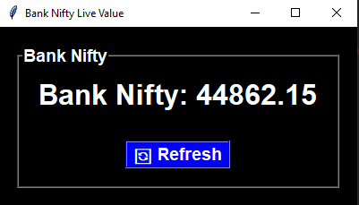

# Bank Nifty Live Value Display


CLICK ON FORK THIS REPO

[](https://github.com/HacktiveMindset/Bank-Nifty-Live-Value-Display/fork)

Bank Nifty Live Value Display is a simple Python application that provides a Graphical User Interface (GUI) to show the live value of the Bank Nifty stock index. 

The GUI is implemented using the tkinter library, and live data is fetched using the yfinance library from the Yahoo Finance API.



## Features

- Displays the live value of Bank Nifty, updated every second.
- Allows manual refreshing of the displayed value.
- Provides a visually appealing and user-friendly interface.

## Prerequisites

- Python 3.11
- pip (Python package manager)

## Installation

Clone the repository to your local machine:

```bash
git clone https://github.com/HacktiveMindset/Bank-Nifty-Live-Value-Display.git

cd Bank-Nifty-Live-Value-Display

pip install -r requirements.txt
```
## How to Use :

Run the script to open the GUI window:
```
python bank_nifty_live_value.py
```
The GUI window will display the live value of Bank Nifty as "N/A" initially.

The value will be updated every second in the label.

To manually refresh the value, click the "Refresh" button.

## Screenshots
 

## Note
The live data for Bank Nifty is fetched from the Yahoo Finance API using the yfinance library. 

Please ensure you have a stable internet connection for real-time updates.

The appearance of the GUI might vary based on your operating system and system settings.

This project is intended for educational and demonstrative purposes and may not be suitable for production use without proper enhancements and validations.

## License
This project is licensed under the MIT License.

[](https://opensource.org/licenses/MIT)

